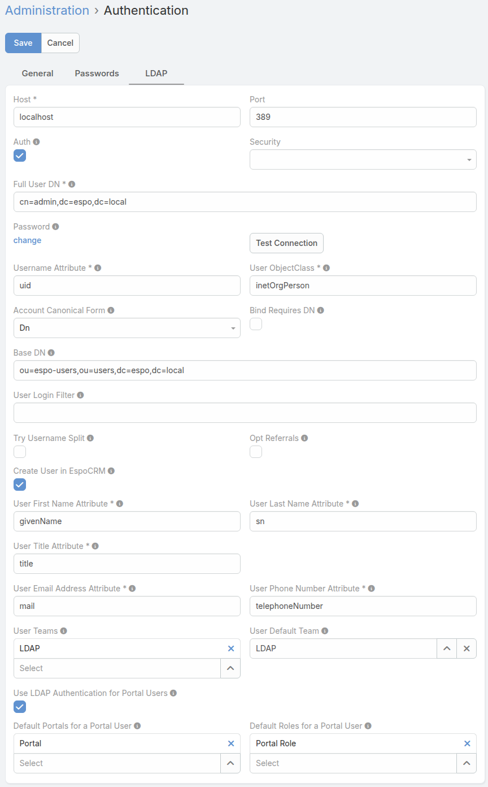

## PHPLDAPAdmin Setup Guide for EspoCRM

1. Copy files from the `files` folder to your server.
  
2. From the folder with the copied files, run the command:

```bash
docker compose up -d
```

3. Configure the LDAP configuration in EspoCRM as follows (instead of `localhost`, specify the IP of your server where EspoCRM is located):



### Credentials to log in for EspoCRM

Regular user name and password:

- *Username:* ldapuser
- *Password:* 1

Portal user name and password:

- *Username:* portaluser
- *Password:* 1
